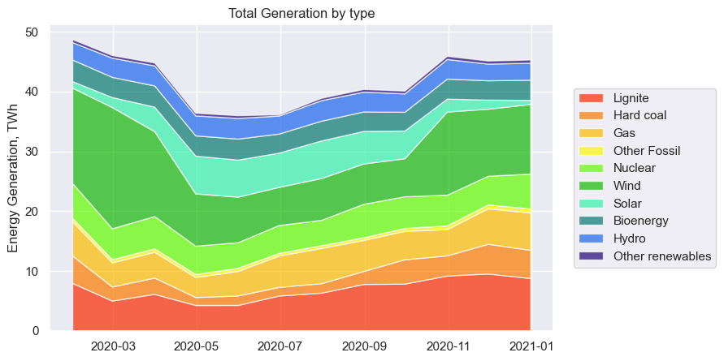

# DATA ANALYSIS OF GERMANY’S ELECTRICITY IMPORTS AND 

##### This project anaylized electricity flows and generation in Germany in 2020

### Motivation and target

- The EU-27 as a whole has made good progress, generating more electricity from renewable than fossil 
fuels for the first time in 2020
- EU Coal market is shrinking, being replaced mostly by Wind and Solar generation
- Even though Germany has a larger share of renewables, it is interesting to find out how net exporting/importing 
affects generation mix

### Methodology

- This study is done with Python programming language
- Raw data was collected from open-source [ENTSO-E Transparency Platform](https://transparency.entsoe.eu/)
- Publications from  [ember-climate.org](https://ember-climate.org/) were helpful for corrections and overview
- Frameworks used: `pandas`, `NumPy`, `matplotlib`, `seaborn`
- Code is presented in three jupyter notebook scripts split into preprocessing/cleaning step
and analysis/visualizations

### Results/Summary

-  **2020** is landmark year, renewables overtook fossil fules 
for the first time. Renewables share – **51%**, fossils share - **36%**
- Wind generation share – **25.77%**, Solar – **9.08%**
- Wind and Solar share in German Electricity mix had an **increase of 22%** from 2019
